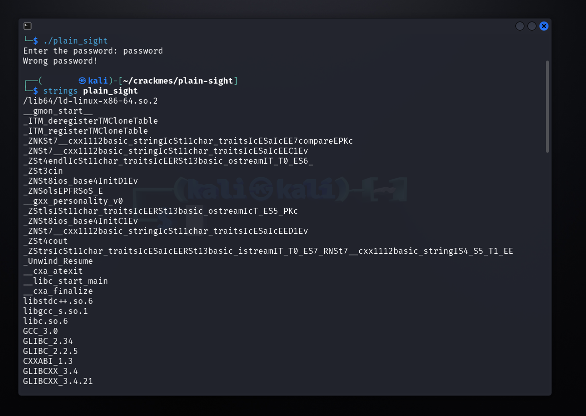

# I3a4dam's Plain sight writeup

## By Chernobyl Mouse [@chernobylmouse6](https://twitter.com/chernobylmouse6)

Date:  2023/11/21 15:45
This [crackmes](https://crackmes.one) can be found [here](https://crackmes.one/crackme/6513567328b5870bef263329).

## Analysis Environment

This analysis was done in a VirtualBox VM running Kali Linux  2023.3.  

## Extracting the File

The downloaded file, **6513567328b5870bef263329.zip**  was unzipped with the program `engrampa`  Archive Manager 1.26.0 using password *crackmes.one*.   This file then contained a second file , **plain_sight.zip**.  This file was also encrypted with the same password,*crackmes.one* and contained a binary file, **plain_sight**.

## Analysis

Using the program `file`  to obtain preliminary information about the program we see that it is an ELF 64-bit dynamically linked and not stripped.  

Upon running the program we see that the program simply asks for a password and gives a response for a wrong password.  

Our next step is the simply list the strings which are found in the binary file.  This is done with `strings` linux command.

In this list of strings we have the highlighted collection of strings which appear in the above run of the program.  The one string which does not appear in the previous output is *do_not_hardcode*.  It is then a reasonable guess to attempt this as the password.

Running the program again and finding using the password *do_not_hardcode* we find success and obtain the Welcome string.

